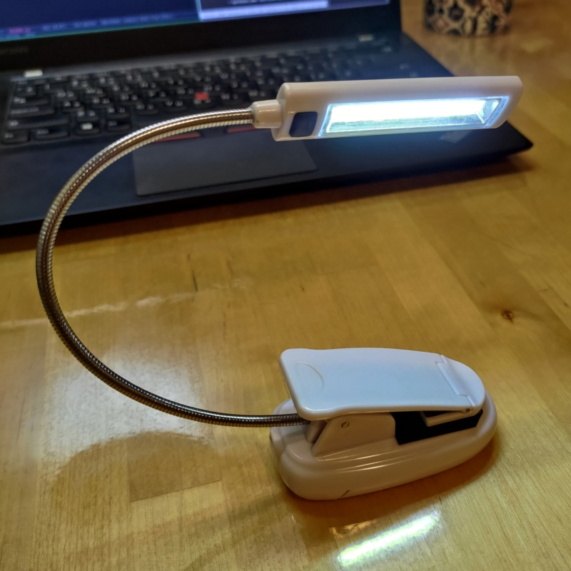
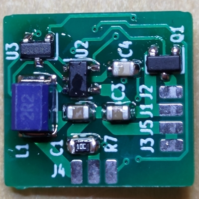
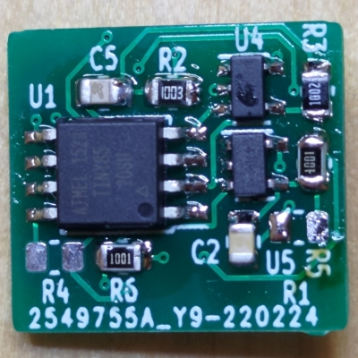

# led_lamp

Slightly overengineered battery powered LED lamp for reading

## Introduction

The project was born when I acquired a battery powered lamp for reading and very soon found its deficiencies.
 - It changed brightness as battery drained.
 - It had only 2 brightness level, both too bright.
 - Its efficiency which I define as a ratio of power coming to LED to power coming from battery is only 0.7.

So I decided to implement my own led driver with mcu control. It actually required some iterations of software and hardware to come up with what is being described here.
 
## Hardware

The lamp consists of "base" with usb connector pcb, batteries and our converter, and "head" with LED panel, switch and pcb.

 
