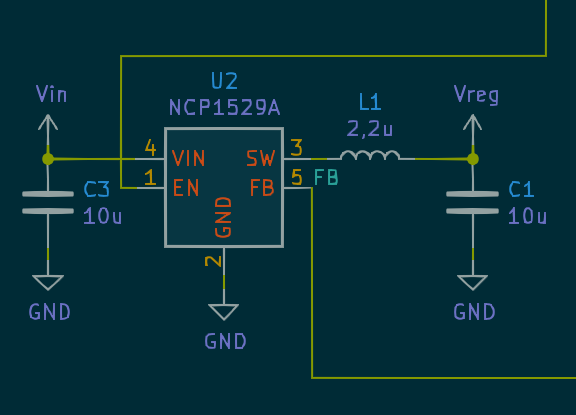
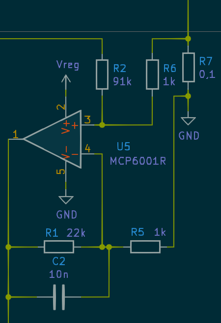
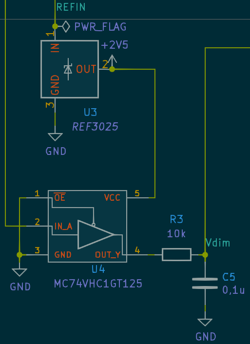

# led_lamp

Slightly overengineered battery powered LED lamp for reading

## Introduction

The project was born when I acquired a battery powered lamp for reading and very soon found its deficiencies.

* It changed brightness as battery drained.
* It had only 2 brightness level, both too bright.
* Its efficiency which I define as a ratio of power coming to LED to power coming from battery is only 0.7.

So I decided to implement my own led driver with mcu control. It actually required some iterations of software and hardware to come up with what is being described here.

## Requirements

* The brightness should be constant as long as the battery voltage under load is higher than some sensible threshold, say 3V. As battery is drained further brightness may gradually decrease.
* When the battery voltage decreases lower than some defined threshold lamp should provide visual indication that battery needs replacement or charging.
* There should be UI for setting the desired brightness level. The brightness levels may be discreet but then there should be enough different levels. The selected brightness level must be kept across the lamp ON-OFF cycles.
* When the battery is completely drained the lamp should clearly indicate this fact and then turn off to prevent battery damage. Lamp should not turn on with a drained battery but provide indication of the flat battery if possible.
 
## Hardware

The lamp consists of "base" with usb connector and batteries, and "head" with a LED panel and a tactile button. The head connected with the base using flexible metallic tube.

### Original hardware

Original electronics consists of two pcbs, one in head and one in base.
The one in the base contains a usb connector, a diode which blocks current from battery to usb VBUS and a 2 Ohm series resistor.
The head pcb contains unmarked chip which obviously provides PWM capability and on/off/mode logic. The LED panel is controlled by a n-channel mosfet. The gate of the mosfet is controlled by the chip. There is also 2 Ohm resistor in series with LED. I assume that the chip is a some obscure uC and there is no LED current limiting except for series resistors.

### Custom hardware

My custom hardware consists of one pcb which contains all the active elements. I also used original pcbs for passive connections. The original base board is used with all parts removed except USB connector. The original head pcb is also cleared of original parts except the button switch and modified using knife and modwire to provide necessary connections. 3 thin wires run inside the connecting tube.

 

*My custom pcb front and back respectively*

### Custom hardware schematics discussion

The parts I used to design the schematics are those I had at my disposal and/or could easyly source locally.

#### DC-DC converter

This is the module that provides LED current regulation. Efficiency of the whole device depends mostly on this module.
[Converter chip](hw/datasheet/NCP1529.pdf) may be disabled by MCU via EN pin. In disabled state it consumes just 0.3 uA. Output voltage is controlled by voltage on the FB pin. It is connected to the LED current amplifier.

#### LED current amplifier

The LED current amlifier is built using [MCP6001R](hw/datasheet/MCP6001_1R_1U_2_4.pdf "MCP6001R") CMOS opamp. It amplifies voltage drop on 0.1 Ohm current sensing resistor *R7*, which is fed to the non-inverting input. The non-inverting input is also biased by the DAC module output voltage via *R2*. This arrangement allows to set current regulation point by programming DAC output. When DAC output is 0V, amplifier outputs 0.6V for 250mA LED current. When the voltage on DAC output is at max, which is slightly below 2.5V, the current regulated at approximately 10mA point. It corresponds to the lowest brightness of the lamp.
So the maximum current is 250mA and the minimum is 10mA.

#### DAC

